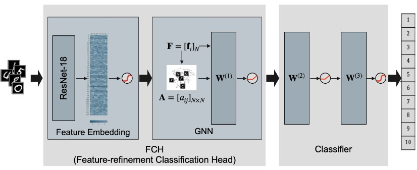
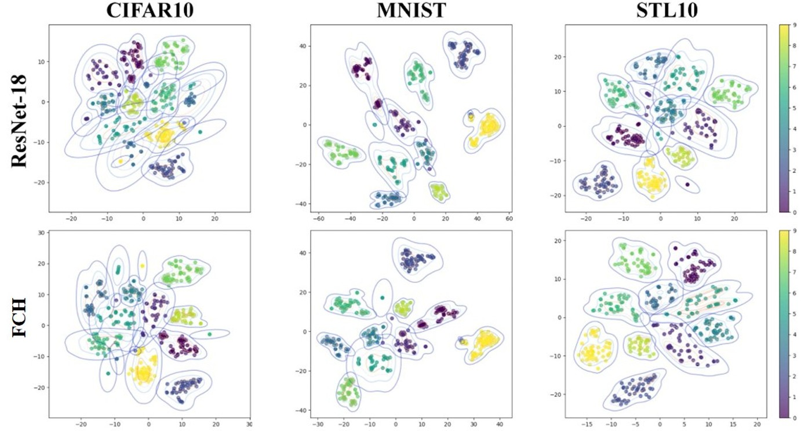

<div align="center">
  
  # Feature-Refinement Classification Head (FCH) for Modeling Inter-Sample Relationships in Neural Networks
  
</div>



This repository provides a PyTorch implementation of **FCH (Feature-refinement Classification Head)**, a lightweight and modular classification head proposed in the paper:

**Feature-Refinement Classification Head (FCH) for Modeling Inter-Sample Relationships in Neural Networks**

FCH enhances image classification by modeling **inter-sample relationships within each mini-batch** using a Graph Neural Network (GNN). It refines backbone feature embeddings through batchwise graph construction and joint optimization of classification and structure-preserving losses.

---

## Abstract


Traditional neural network classifiers assume that training samples are statistically independent. 
However, real-world data often exhibit inter-sample dependencies and structural correlations, making this assumption inadequate for capturing rich and discriminative feature representations. 
Conventional classifiers treat data samples as independent, overlooking relational information that is essential for learning accurate and expressive feature representations. 
To address this limitation, we propose FCH (Feature-refinement Classification Head), a novel classification head that constructs adjacency matrices to model inter-sample relationships among embedding vectors within each batch and refines feature representations through transfer learning and a graph neural network.
FCH can be seamlessly integrated into existing architectures and supports end-to-end learning through the joint optimization of cross-entropy and structure-preserving losses.
Experimental results demonstrate that modeling inter-sample relationships significantly enhances classification performance. 
FCH consistently improves accuracy, precision, recall, and F1-score across diverse backbone architectures on standard benchmarks such as CIFAR-10, MNIST, and STL-10. Moreover, it maintains strong performance even in lightweight models, highlighting its robustness and scalability across model sizes. FCH is a generalizable and scalable module that enhances image classification by leveraging structural relationships, thereby strengthening representational capacity and overall model performance.

---

## Key Ideas

* Treats samples in a mini-batch as nodes in a graph
* Builds an adjacency matrix from feature similarities (RBF, k-NN, Attention, or Class-Label based)
* Applies a GNN layer to refine embeddings using relational information
* Optimizes a joint objective:

  * Cross-entropy loss for classification
  * Structure-preserving loss to align learned relations with label structure

---

## Architecture Overview

1. **Backbone Feature Extractor**
   A standard CNN or Transformer (e.g., ResNet-18, ViT-B/16) extracts D-dimensional embeddings.

2. **Batchwise Graph Construction**
   Each mini-batch is treated as a graph, where nodes are samples and edges are defined by feature similarity.

3. **Graph Neural Network Layer**
   A Chebyshev polynomial-based graph convolution aggregates neighborhood information to refine features.

4. **MLP Classifier**
   A two-layer MLP maps refined embeddings to class probabilities.

---

## Supported Adjacency Types

* **RBF-FCH**: Radial Basis Function kernel on feature distances
* **NN-FCH**: k-nearest neighbor graph with RBF weights
* **Att-FCH**: Dot-product attention with neighborhood restriction
* **CL-FCH**: Binary graph using class-label consistency

---

## Installation

```bash
conda create -n fch python=3.9
conda activate fch
pip install -r requirements.txt
```

---

## Training Example

```bash
#!/bin/bash

# ===========================================================
# run.sh : Training launcher with log saving
#
# Usage:
#   bash run.sh                # single GPU / CPU
#   bash run.sh ddp 4          # run DDP with 4 GPUs
#
# Log file is automatically saved to:
#   logs/run_<timestamp>.log
# ===========================================================

set -e

# Create logs directory
mkdir -p logs

# Timestamp for log file name
TIMESTAMP=$(date "+%Y%m%d_%H%M%S")
LOG_FILE="logs/run_${TIMESTAMP}.log"

echo "[run.sh] Log file: $LOG_FILE"

MODE=$1
NUM_PROCS=$2

# -----------------------------------------------------------
# Single GPU / CPU mode
# -----------------------------------------------------------
if [ "$MODE" = "" ]; then
    echo "[run.sh] Running in single-process mode..."
    python main.py 2>&1 | tee "$LOG_FILE"
    exit 0
fi

# -----------------------------------------------------------
# Distributed Data Parallel Mode (DDP)
# -----------------------------------------------------------
if [ "$MODE" = "ddp" ]; then
    if [ "$NUM_PROCS" = "" ]; then
        echo "[run.sh] ERROR: GPU count required."
        echo "Usage: bash run.sh ddp 4"
        exit 1
    fi

    echo "[run.sh] Running in DDP mode with $NUM_PROCS GPUs..."
    torchrun \
        --standalone \
        --nnodes=1 \
        --nproc_per_node=$NUM_PROCS \
        main.py 2>&1 | tee "$LOG_FILE"

    exit 0
fi

echo "[run.sh] Unknown mode: $MODE"
echo "Usage:"
echo "  bash run.sh"
echo "  bash run.sh ddp 4"
exit 1
```

---

## Experimental Results

### Classification Performance (Accuracy)

| Model                        | CIFAR-10  | MNIST     | STL-10    |
| ---------------------------- | --------- | --------- | --------- |
| EfficientNetV2-L             | 0.991     | 0.998     | 0.950     |
| DeiT-B                       | 0.991     | 0.997     | 0.948     |
| VGG-5                        | 0.904     | 0.990     | 0.940     |
| Att-FCH (ResNet-18, p=5)     | 0.963     | 0.993     | 0.910     |
| NN-FCH (ResNet-18, p=4)      | 0.972     | 0.994     | 0.915     |
| CL-FCH (ResNet-18, p=1)      | 0.971     | 0.994     | 0.914     |
| **RBF-FCH (ResNet-18, p=1)** | **0.979** | **0.995** | **0.922** |
| Att-FCH (ViT-B/16, p=5)      | 0.977     | 0.996     | 0.948     |
| NN-FCH (ViT-B/16, p=4)       | 0.977     | 0.996     | 0.950     |
| CL-FCH (ViT-B/16, p=1)       | 0.976     | 0.996     | 0.949     |
| **RBF-FCH (ViT-B/16, p=1)**  | **0.979** | **0.997** | **0.953** |

These results demonstrate that FCH:

* Consistently improves performance across datasets and backbones
* Provides strong gains on CIFAR-10 and STL-10
* Achieves competitive accuracy with far fewer parameters than large-scale models




<div align="center">

T-SNE visualization of feature embeddings
  
</div>

---

## Model Complexity

| Model                    | Params (MB) | GFLOPs |
| ------------------------ | ----------- | ------ |
| EfficientNetV2-L         | 454.05      | 12.41  |
| DeiT-B                   | 330.22      | 16.87  |
| VGG-5                    | 81.55       | 19.63  |
| RBF-FCH (ResNet-18, p=1) | 43.00       | 4.22   |
| RBF-FCH (ViT-B/16, p=1)  | 333.75      | 15.52  |

FCH (ResNet-18) delivers competitive accuracy with only ~43 MB parameters and ~4.2 GFLOPs.

---

## License

This project is released under the MIT License.

---
